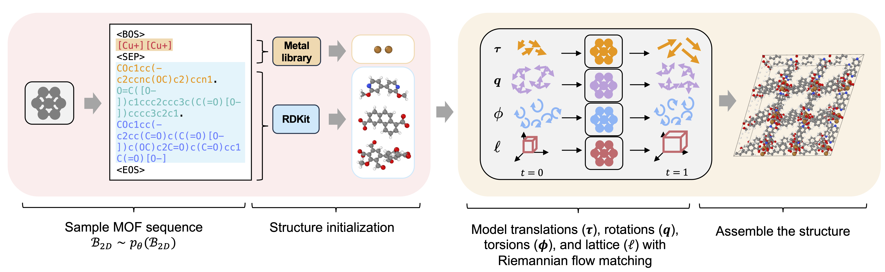
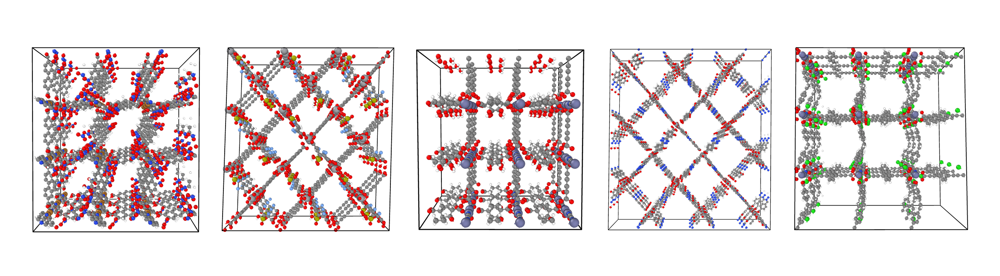

# Flexible MOF Generation with Torsion-Aware Flow Matching (MOFFlow-2)

[](https://www.arxiv.org/abs/2505.17914)

<p align="center">
  
  
</p>

## Table of Contents
- [Installation](#installation)
  - [Clone repository](#clone-repository)
  - [Setup environment](#setup-environment)
  - [Setup .env file](#setup-env-file)
- [Preprocessing Data](#preprocessing-data)
- [Training](#training)
- [Structure Prediction Evaluation](#structure-prediction-evaluation)
  - [Match rate & RMSE](#match-rate--rmse)
- [Generation](#generation)
  - [Validity, Novelty, and Uniqueness (VNU)](#validity-novelty-and-uniqueness-vnu)
  - [Property Evaluation (with zeo++)](#property-evaluation-with-zeo)
- [📚 Citation](#-citation)

## Installation 

### Clone repository
```bash
git clone https://github.com/nayoung10/MOFFlow-2.git # clone repo
cd MOFFlow
```

### Setup environment 
```bash
mamba env create -f env.yml
mamba activate mofflow
pip install git+https://github.com/microsoft/MOFDiff.git
pip install -e .
```

For **property computation**, we need to install `zeo++` from [here](https://www.zeoplusplus.org/download.html). 

### Create ```.env```

Create ```.env``` file with following entries. 
```bash
export PROJECT_ROOT=<root_dir>
export ZEO_PATH=<path_to_network_binary> # (Optional) for property computation
```

## Preprocessing Data

You can preprocess the data in two ways:

### Option 1: Use Preprocessed Data
Download the preprocessed datasets (and the checkpoints) from [this link](). After unzipping, the directory structure should look as follows:
```
data/                          <- Project dataset directory

├── lmdb/                      <- Preprocessed dataset for training structure prediction module
│   ├── csp/
│   │   ├── MetalOxo_final_train.lmdb
│   │   ├── MetalOxo_final_val.lmdb
│   │   └── MetalOxo_final_test.lmdb
│   └── gen/
│       ├── MetalOxo_final_train.lmdb
│       └── MetalOxo_final_val.lmdb
│
├── metals/                    <- Metal library (template) for generation
│   └── gen/
│       └── metal_lib_train.pkl
│
├── seqs/                      <- Preprocessed dataset for training building block generator
│   ├── mof_sequence_train.json
│   ├── mof_sequence_val.json
│   └── vocab.json
│
├── splits/                    <- Split information when you want to preprocess on your own
│   ├── csp/
│   │   ├── test_split.txt
│   │   ├── train_split.txt
│   │   └── val_split.txt
│   └── gen/
│       ├── train_split.txt
│       └── val_split.txt
│
└── bb_lib/                    <- Libraries for evaluating NBB of generated sequences
    ├── metals.pkl
    └── organics.pkl
```

### Option 2: Preprocess Data Yourself
#### Structure dataset
1. Download `bw_db.tar.gz` from [MOFDiff](https://zenodo.org/records/10806179).
2. Extract and place `MetalOxo.lmdb` in the `data/lmdb` directory.
3. Set the task (`csp` or `gen`) in `configs.yaml` under `preprocess.task`.
4. Run the automated preprocessing script:

```bash
# Run the full preprocessing pipeline automatically
# Creates raw dataset for structure prediction module (in .lmdb)
python preprocess.py --task <csp|gen>
```
*Script options:*
- `--task <csp|gen>`: **(Required)** Specify the task type.
- `--mof-matching-repeat <N>`: Number of times to repeat the MOF matching step (default: 3).
- `--skip-baseline`: Skip the baseline format conversion steps (CSV/PKL). This is enabled by default.

#### Sequence dataset
Now, create train/validation datasets for the sequence generator module with the following script. This creates `mof_sequence_train.json` and `mof_sequence_val.json` in the `data/seqs` directory. 
```bash
# Create raw dataset for MOF sequence generator (in .json)
python preprocess/extract_sequence.py
```

## Training

### Structure Prediction
Train the structure prediction module:

```bash
python experiments/train.py experiment.task=csp experiment.name=<exp_name>
```

### Generation
For the generation task, train both the building block generator and the structure prediction module.

1. **Train the MOF sequence generator**: This model learns to MOF sequences. See `configs/base_seq.yaml` for details. If you encounter OOM errors, reduce `data.loader.max_tokens` and/or specify `data.loader.max_batch_size`. Note: `model.max_seq_len` is a dummy, as rotary positional embedding is used.

   ```bash
   python experiments/train_seq.py experiment.name=<exp_name>
   ```

2. **Train the structure prediction module**: This model predicts the assembled structure given ground-truth building blocks. See `configs/base.yaml` for details. Dynamic batching is used; if you encounter OOM errors, try reducing `data.loader.dynamic.max_num_atoms` and/or specify `data.loader.dynamic.max_batch_size`.

   ```bash
   python experiments/train.py experiment.task=gen experiment.name=<exp_name>
   ```

## Generate MOF structures

### Structure prediction 
To generate the MOF structures for the test set, run the following code. You may specify the number of samples to generate per test sample. For more details, look into `configs/inference.yaml`. 

```bash
python experiments/predict.py \
    inference.task=csp \
    inference.ckpt_path=<path/to/ckpt/last.pt> \ # default to null
    inference.num_samples=<num_samples> \   # default to 1
    inference.num_devices=<num_devices> \ # default to 8 
    inference.sampler.num_timesteps=<timesteps> \ # default to 50
```

### Generation 

For generation, we (1) generate MOF sequences with trained MOF sequence generator (saved as `.json`), then (2) predict MOF structures with trained MOF structure prediction module. 

```bash
# 1. Generate MOF sequences (check `configs/inference_seq.yaml` for details.)
python experiments/predict_seq.py \
    inference.ckpt_path=<path/to/ckpt/last.ckpt> \ # default to null
    inference.total_samples=<num_samples> # default to 10000

# 2. Predict MOF structures (check `configs/inference.yaml` for details.)
python experiments/predict.py \
    inference.task=gen \
    inference.ckpt_path=<path/to/ckpt/last.pt> \ # default to null
    inference.gen.metal_lib_path=<path/to/metal_lib_train.pkl> \ # for initializing metal structures 
    inference.gen.mof_seqs_path=<path/to/seq.json> \ # path to .json file generated from Step 1
    inference.num_samples=1 
```

## Evaluation 

All codes relevant to evaluation are under `evaluation/` directory. 

### Structure prediction 

#### Match rate & RMSE 
We compute the match rate and RMSE between the predicted and ground-truth structures. To do this, run the following script:

```bash
python evaluation/rmsd.py \
    --save_pt </path/to/predictions_*.pt> \
    --num_samples <num_samples>
```

**Arguments:**
- `--save_pt`: Glob pattern for `.pt` files generated by `experiments/predict.py` (e.g., `inference/predictions_*.pt`).
- `--num_samples`: (Optional) Number of samples to evaluate per test structure. If not specified, defaults to the value used during prediction (see `configs/inference.yaml`).

### Generation 

#### Validity, Novelty, and Uniqueness (VNU)

We evaluate the generated MOFs in two stages: first at the sequence level, then at the structure level. The final VNU metric combines both results.

**Step 1: Evaluate VNU for generated sequences**

```bash
python evaluation/valid_seq.py \
    --generated_json <path/to/generated/sequence.json> \
    --train_json <data/seqs/mof_sequence_train.json> \
    --bb_lib_dir <data/bb_lib>
```
- `--generated_json`: Path to the generated sequence `.json` file (from `experiments/predict_seq.py`).
- `--train_json`: Path to the training dataset `mof_sequence_train.json` file (used for novelty evaluation).
- `--bb_lib_dir`: Path to the building block library directory. If `metals.pkl` and `organics.pkl` do not exist in this directory, they will be created automatically from the training set.

**Step 2: Evaluate VNU for generated structures**

1. **Convert predicted structures to CIF format:**
   ```bash
   python io/pt_to_cif.py \
       --save_pt </path/to/predictions_*.pt>
   ```
   - `--save_pt`: Glob pattern for `.pt` files from `experiments/predict.py`.

2. **Evaluate VNU for structures:**
   ```bash
   python evaluation/valid.py \
       --cif_path <path/to/cif/files/*.cif> \
       --csv_path <path/to/sequence/vnu/results.csv>
   ```
   - `--cif_path`: Glob pattern for CIF files generated in the previous step (Step 2-1).
   - `--csv_path`: Path to the VNU evaluation result (CSV) from Step 1.

---

#### Property Evaluation (with `zeo++`)

To compute properties of the generated structures using `zeo++`, run:

```bash
python evaluation/property.py \
    --cif_dir <path/to/cif/dir> \
    --num_cpus <num_cpus>
```
- `--cif_dir`: Directory containing the generated CIF files.
- `--num_cpus`: Number of CPUs to use for parallel computation.

## 📚 Citation

If you find our work useful, please consider citing the following:

```bibtex
@article{kim2025flexible,
  title={Flexible MOF Generation with Torsion-Aware Flow Matching},
  author={Kim, Nayoung and Kim, Seongsu and Ahn, Sungsoo},
  journal={arXiv preprint arXiv:2505.17914},
  year={2025}
}
```
